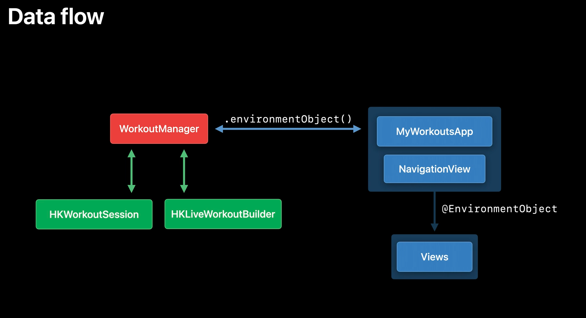
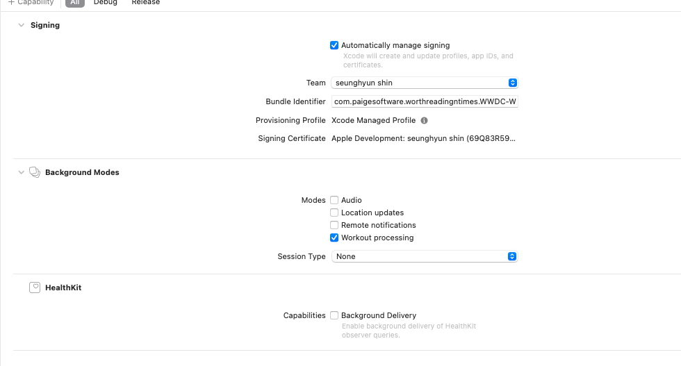
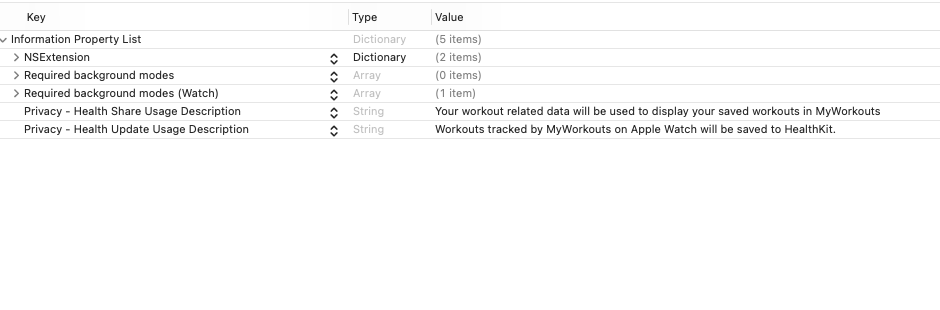
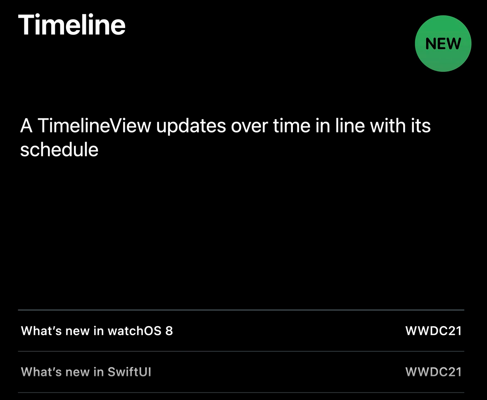
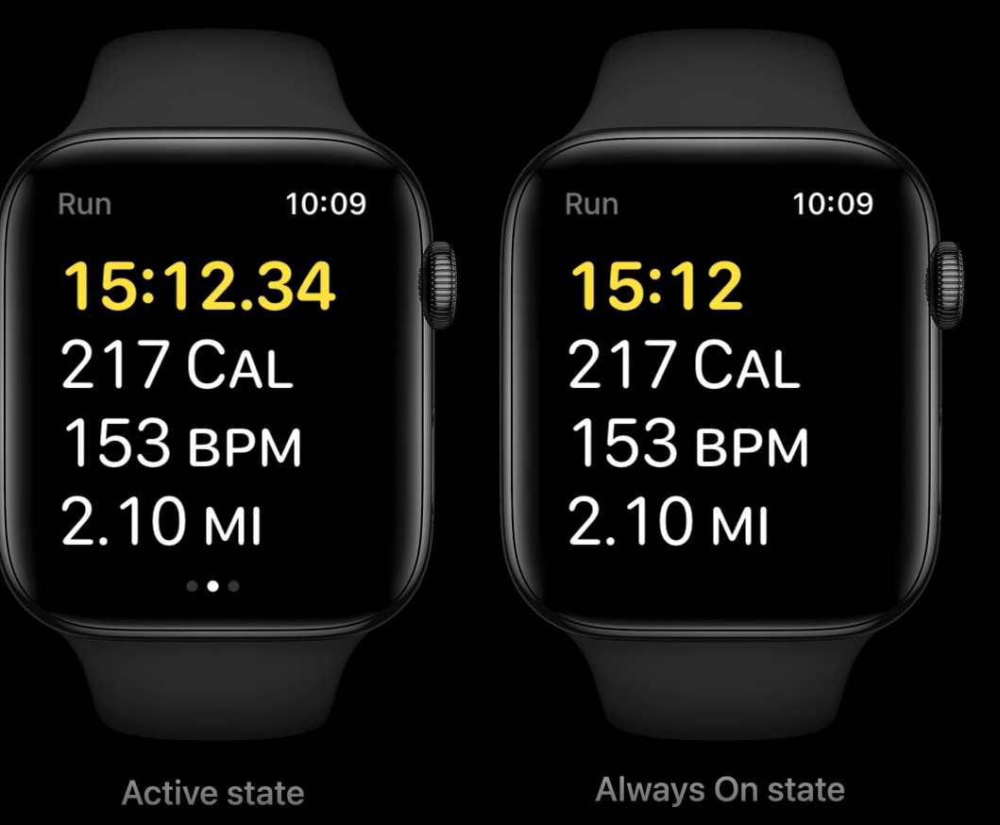

# **Build a workout app for Apple Watch**

Build a workout app from scratch using SwiftUI and HealthKit during this code along. Learn how to support the Always On state using timelines to update workout metrics. Follow best design practices for workout apps.

### Healthkit

- HKWorkoutSession
- HKLiveWorkoutBuilder

### Dataflow



### Capability



### Privacy



### Timeline

- A TimelineView updates over time in line with its schedule





### WrapUp

- SwiftUI
- HealthKit Integration
- Always on state

# Code

- App

```swift
//
//  WWDC_WatchAppApp.swift
//  WWDC_WatchApp WatchKit Extension
//
//  Created by paige on 2021/12/11.
//

import SwiftUI
import HealthKit

@main
struct WWDC_WatchAppApp: App {

    @StateObject private var workoutManager = WorkoutManager()

    var body: some Scene {
        WindowGroup {
            NavigationView {
                StartView()
            }
            .sheet(isPresented: $workoutManager.showingSummaryView) {
                SummaryView()
            }
            .environmentObject(workoutManager)
        }
    }
}
```

- WorkoutManager

```swift
//
//  WorkoutManager.swift
//  WWDC_WatchApp WatchKit Extension
//
//  Created by paige on 2021/12/11.
//

import Foundation
import HealthKit

// MARK: WORKOUT MANAGER
/*
 Initialize..

 List(workoutTypes) { workoutType in
 NavigationLink(
 workoutType.name,
 destination: SessionPagingView(),
 tag: workoutType,
 selection: $workoutManager.selectedWorkout
 )
 .padding(
 EdgeInsets(top: 15, leading: 5, bottom: 15, trailing: 5)
 ) //: NAVIGATION LINK
 } //: LIST
 .listStyle(.carousel)
 .navigationBarTitle("Workouts")

 */
class WorkoutManager: NSObject, ObservableObject {

    var selectedWorkout: HKWorkoutActivityType? {
        didSet {
            guard let selectedWorkout = selectedWorkout else { return }
            startWorkout(workoutType: selectedWorkout)
        }
    }

    @Published var showingSummaryView: Bool = false {
        didSet {
            // Sheet dismissed
            if showingSummaryView == false {
                resetWorkout()
            }
        }
    }

    let healthStore = HKHealthStore()
    var session: HKWorkoutSession?
    var builder: HKLiveWorkoutBuilder?

    func startWorkout(workoutType: HKWorkoutActivityType) {
        let configuration = HKWorkoutConfiguration()
        configuration.activityType = workoutType
        configuration.locationType = .outdoor

        do {
            session = try HKWorkoutSession(healthStore: healthStore, configuration: configuration)
            builder = session?.associatedWorkoutBuilder()
        } catch {
            // Handle any exceptions.
            return
        }

        builder?.dataSource = HKLiveWorkoutDataSource(healthStore: healthStore, workoutConfiguration: configuration)

        session?.delegate = self
        builder?.delegate = self

        // Start the workout session and begin data collection.
        let startDate = Date()
        session?.startActivity(with: startDate)
        builder?.beginCollection(withStart: startDate, completion: { success, error in
            // The workout has started
        })

    }

    // Request authorization to access Healthkit.
    func requestAuthorization() {

        // The quantity type to write to the health store.
        let typesToShare: Set = [
            HKQuantityType.workoutType()
        ]

        // The quantity types to read from the health store.
        let typesToRead: Set = [
            HKQuantityType.quantityType(forIdentifier: .heartRate)!,
            HKQuantityType.quantityType(forIdentifier: .activeEnergyBurned)!,
            HKQuantityType.quantityType(forIdentifier: .distanceWalkingRunning)!,
            HKQuantityType.quantityType(forIdentifier: .distanceCycling)!,
            HKObjectType.activitySummaryType()
        ]

        // Request authorization for those quantity types
        healthStore.requestAuthorization(toShare: typesToShare, read: typesToRead) { success, error in
            // Handle error.
        }

    }

    // MARK: - State Control

    // The workout session state
    @Published var running = false

    func pause() {
        session?.pause()
    }

    func resume() {
        session?.resume()
    }

    func togglePuase() {
        if running == true {
            pause()
        } else {
            resume()
        }
    }

    func endWorkout() {
        session?.end()
        showingSummaryView = true
    }

    // MARK: - Workout Metrics
    @Published var averageHeartRate: Double = 0
    @Published var heartRate: Double = 0
    @Published var activeEnergy: Double = 0
    @Published var distance: Double = 0
    @Published var workout: HKWorkout?

}

// MARK: - HKWorkoutSessionDelegate
extension WorkoutManager: HKWorkoutSessionDelegate {

    func workoutSession(_ workoutSession: HKWorkoutSession, didChangeTo toState: HKWorkoutSessionState, from fromState: HKWorkoutSessionState, date: Date) {
        DispatchQueue.main.async {
            self.running = toState == .running
        }
        // Wait for the session to transition states before ending the builder.
        if toState == .ended {
            builder?.endCollection(withEnd: date, completion: { success, error in
                self.builder?.finishWorkout(completion: { workout, error in
                    DispatchQueue.main.async {
                        self.workout = workout
                    }
                })
            })
        }
    }

    func workoutSession(_ workoutSession: HKWorkoutSession, didFailWithError error: Error) {

    }

}

// MARK: - HKLiveWorkoutBuilderDelegate
extension WorkoutManager: HKLiveWorkoutBuilderDelegate {

    func workoutBuilderDidCollectEvent(_ workoutBuilder: HKLiveWorkoutBuilder) {

    }

    func workoutBuilder(_ workoutBuilder: HKLiveWorkoutBuilder, didCollectDataOf collectedTypes: Set<HKSampleType>) {
        for type in collectedTypes {
            guard let quantityType = type as? HKQuantityType else { return }
            let statistics = workoutBuilder.statistics(for: quantityType)

            // Update the published values.
            updateForStatistics(statistics)
        }
    }

    func updateForStatistics(_ statistics: HKStatistics?) {

        guard let statistics = statistics else {
            return
        }

        DispatchQueue.main.async {

            switch statistics.quantityType {

            case HKQuantityType.quantityType(forIdentifier: .heartRate):
                let heartRateUnit = HKUnit.count().unitDivided(by: HKUnit.minute())
                self.heartRate = statistics.mostRecentQuantity()?.doubleValue(for: heartRateUnit) ?? 0
                self.averageHeartRate = statistics.averageQuantity()?.doubleValue(for: heartRateUnit) ?? 0

            case HKQuantityType.quantityType(forIdentifier: .activeEnergyBurned):
                let energyUnit = HKUnit.kilocalorie()
                self.activeEnergy = statistics.sumQuantity()?.doubleValue(for: energyUnit) ?? 0

            case HKQuantityType.quantityType(forIdentifier: .distanceWalkingRunning), HKQuantityType.quantityType(forIdentifier: .distanceCycling):
                let meterUnit = HKUnit.meter()
                self.distance = statistics.sumQuantity()?.doubleValue(for: meterUnit) ?? 0

            default: return

            }
        }

    }

    func resetWorkout() {
        selectedWorkout = nil
        builder = nil
        session = nil
        workout = nil
        activeEnergy = 0
        averageHeartRate = 0
        heartRate = 0
        distance = 0
    }

}
```

- StartView

```swift
//
//  ContentView.swift
//  WWDC_WatchApp WatchKit Extension
//
//  Created by paige on 2021/12/11.
//

import SwiftUI
import HealthKit

struct StartView: View {

    @EnvironmentObject var workoutManager: WorkoutManager
    private var workoutTypes: [HKWorkoutActivityType] = [.cycling, .running, .walking]

    var body: some View {
        // MARK: - LIST IN WATCH
        List(workoutTypes) { workoutType in
            NavigationLink(
                workoutType.name,
                destination: SessionPagingView(),
                tag: workoutType,
                selection: $workoutManager.selectedWorkout
            )
                .padding(
                    EdgeInsets(top: 15, leading: 5, bottom: 15, trailing: 5)
                ) //: NAVIGATION LINK
        } //: LIST
        .listStyle(.carousel)
        .navigationBarTitle("Workouts")
        .onAppear {
            workoutManager.requestAuthorization()
        }
    }
}

struct StartView_Previews: PreviewProvider {
    static var previews: some View {
        StartView()
    }
}

// MARK: EXTENSION FOR MAPPING ENUMS VALUES WITH NAME
extension HKWorkoutActivityType: Identifiable {

    public var id: UInt {
        rawValue
    }

    var name: String {
        switch self {
        case .running:
            return "Run"
        case .cycling:
            return "Bike"
        case .walking:
            return "Walk"
        default:
            return ""
        }
    }

}
```

- ActivityRingsView

```swift
//
//  ActivityRingsView.swift
//  WWDC_WatchApp WatchKit Extension
//
//  Created by paige on 2021/12/11.
//

import Foundation
import HealthKit
import SwiftUI

// MARK: ACTIVITY RINGS VIEW
// How to use
/*
 Text("Activity Rings")
 ActivityRingsView(heatlStore: HKHealthStore())
     .frame(width: 50, height: 50)
 */
struct ActivityRingsView: WKInterfaceObjectRepresentable {

    let heatlStore: HKHealthStore

    func makeWKInterfaceObject(context: Context) -> some WKInterfaceObject {
        let activityRingsObject = WKInterfaceActivityRing()

        let calendar = Calendar.current
        var components = calendar.dateComponents([.era, .year, .month, .day], from: Date())
        components.calendar = calendar

        let predicate = HKQuery.predicateForActivitySummary(with: components)

        let query = HKActivitySummaryQuery(predicate: predicate) { query, summaries, error in
            DispatchQueue.main.async {
                activityRingsObject.setActivitySummary(summaries?.first, animated: true)
            }
        }

        heatlStore.execute(query)

        return activityRingsObject
    }

    func updateWKInterfaceObject(_ wkInterfaceObject: WKInterfaceObjectType, context: Context) {

    }

}
```

- SummaryView

```swift
//
//  SummaryView.swift
//  WWDC_WatchApp WatchKit Extension
//
//  Created by paige on 2021/12/11.
//

import SwiftUI
import HealthKit

struct SummaryView: View {

    @EnvironmentObject private var workoutManager: WorkoutManager

    // MARK: DISMISS ENVIRONMENT VARIABLE
    @Environment(\.dismiss) private var dismiss
    /*
     Button("Done") {
         dismiss()
     }
     */

    // MARK: Formatter
    @State private var durationFormatter: DateComponentsFormatter = {
        let formatter = DateComponentsFormatter()
        formatter.allowedUnits = [.hour, .minute, .second]
        formatter.zeroFormattingBehavior = .pad
        return formatter
    }()

    var body: some View {

        if workoutManager.workout == nil {
            // MARK: PROGRES VIEW
            ProgressView("Saving workout")
                .navigationBarHidden(true)
        } else {
            ScrollView(.vertical) {
                VStack(alignment: .leading) {

                    SummaryMetricView(
                        title: "Total Time",
                        value: durationFormatter.string(from: workoutManager.workout?.duration ?? 0.0) ?? ""
                    )
                    .accentColor(.yellow)

                    SummaryMetricView(
                        title: "Total Distance",
                        value: Measurement(
                            value: workoutManager.workout?.totalDistance?.doubleValue(for: .meter()) ?? 0, unit: UnitLength.meters
                        ).formatted(
                            .measurement(width: .abbreviated, usage: .road)
                        )
                    )
                    .accentColor(.green)

                    SummaryMetricView(
                        title: "Total Energy",
                        value: Measurement(
                            value: workoutManager.workout?.totalEnergyBurned?.doubleValue(for: .kilocalorie()) ?? 0, unit: UnitEnergy.kilocalories
                        ).formatted(
                            .measurement(
                                width: .abbreviated,
                                usage: .workout,
                                numberFormatStyle:
                                    FloatingPointFormatStyle
                                    .number
                                    .precision(.fractionLength(0))
                            )
                        )
                    )
                    .accentColor(.pink)

                    SummaryMetricView(
                        title: "Avg. Heart Rate",
                        value: workoutManager.averageHeartRate
                            .formatted(
                                .number
                                .precision(.fractionLength(0))
                            )
                            +
                            " bpm"
                    )
                    .accentColor(.red)

                    Text("Activity Rings")
                    ActivityRingsView(heatlStore: HKHealthStore())
                        .frame(width: 50, height: 50)

                    Button("Done") {
                        dismiss()
                    }

                } //: VSTACK
                .scenePadding()
            } //: SCROLLVIEW
            .navigationTitle("Summary")
            .navigationBarTitleDisplayMode(.inline)
        }

    }
}

struct SummaryView_Previews: PreviewProvider {
    static var previews: some View {
        SummaryView()
    }
}

struct SummaryMetricView: View {

    var title: String
    var value: String

    var body: some View {

        Text(title)
        Text(value)
            .font(
                .system(.title2, design: .rounded)
                    .lowercaseSmallCaps()
            )
            .foregroundColor(.accentColor)
        Divider()
    }

}
```

- SessionPagingView (TabView)

```swift
//
//  SessionPagingView.swift
//  WWDC_WatchApp WatchKit Extension
//
//  Created by paige on 2021/12/11.
//

import SwiftUI
import WatchKit

// MARK: - TABVIEW WITH ENUM
struct SessionPagingView: View {

    //MARK: isLuminanceReduced
    @Environment(\.isLuminanceReduced) var isLuminanceReduced
    /*
     .tabViewStyle(
         PageTabViewStyle(indexDisplayMode: isLuminanceReduced ? .never : .automatic)
     )
     .onChange(of: isLuminanceReduced) { _ in
         dispayMetricsView()
     }
     */

    @EnvironmentObject private var workoutManager: WorkoutManager
    @State private var selection: Tab = .metrics

    enum Tab {
        case controls, metrics, nowPlaying
    }

    var body: some View {
        TabView(selection: $selection) {
            ControlsView().tag(Tab.controls)
            MetricsView().tag(Tab.metrics)
            // MARK: NowPlayingView is provided by WatchKit
            NowPlayingView().tag(Tab.nowPlaying)
        }
        .navigationTitle(workoutManager.selectedWorkout?.name ?? "")
        .navigationBarBackButtonHidden(true)
        .navigationBarHidden(selection == .nowPlaying)
        .onChange(of: workoutManager.running) { _ in
            dispayMetricsView()
        }
        .tabViewStyle(
            PageTabViewStyle(indexDisplayMode: isLuminanceReduced ? .never : .automatic)
        )
        .onChange(of: isLuminanceReduced) { _ in
            dispayMetricsView()
        }
    }

    private func dispayMetricsView() {
        withAnimation {
            selection = .metrics
        }
    }
}

struct SessionPagingView_Previews: PreviewProvider {
    static var previews: some View {
        SessionPagingView()
    }
}
```

- ControlsView

```swift
//
//  ControlsView.swift
//  WWDC_WatchApp WatchKit Extension
//
//  Created by paige on 2021/12/11.
//

import SwiftUI

struct ControlsView: View {

    @EnvironmentObject var workoutManager: WorkoutManager

    var body: some View {
        HStack {

            VStack {
                Button {
                    workoutManager.endWorkout()
                } label: {
                    Image(systemName: "xmark")
                } //: BUTTON
                .tint(.red)
                .font(.title2)

                Text("End") //: TEXT

            } //: VSTACK

            VStack {
                Button {
                    workoutManager.togglePuase()
                } label: {
                    Image(systemName: workoutManager.running ? "pause" : "play")
                } //: BUTTON
                .tint(.yellow)
                .font(.title2)
                Text("Pause")
            } //: VSTACK

        } //: HSTACK
    }
}

struct ControlsView_Previews: PreviewProvider {
    static var previews: some View {
        ControlsView()
    }
}
```

- MetricsView

```swift
//
//  MetricsView.swift
//  WWDC_WatchApp WatchKit Extension
//
//  Created by paige on 2021/12/11.
//

import SwiftUI

struct MetricsView: View {

    @EnvironmentObject private var workoutManager: WorkoutManager

    var body: some View {
        ScrollView(showsIndicators: false) {
            VStack(alignment: .leading) {

                // MARK: TIMELINE VIEW, Timer
                TimelineView(
                    MetricsTimelinesSchedule(from: workoutManager.builder?.startDate ?? Date())) { context in
                        VStack(alignment: .leading) {
                            ElapsedTimeView(
                                elapsedTime: workoutManager.builder?.elapsedTime ?? 0,
                                showSubseconds: context.cadence == .live
                            )
                            .foregroundColor(.yellow)
    //                        Text(
    //                            Measurement(
    //
    //                            )
    //                        )
                        }
                    } //TimelineView


                // MARK: - MEASUREMENT
                Text(
                    Measurement(
                        value: workoutManager.activeEnergy,
                        unit: UnitEnergy.kilocalories
                    )
                    .formatted(
                        .measurement(width: .abbreviated,
                                     usage: .workout,
                                     numberFormatStyle:
                                        FloatingPointFormatStyle
                                        .number
                                        .precision(
                                            .fractionLength(0)
                                        )
                                    )
                    )
                ) // CALORIES TEXT

                Text(
                    workoutManager.heartRate
                    .formatted(
                        .number
                        .precision(
                            .fractionLength(0)
                        )
                    )
                    +
                    " bpm"
                ) // BPM TEXT

                Text(
                    Measurement(
                        value: workoutManager.distance,
                        unit: UnitLength.meters
                    )
                    .formatted(
                        .measurement(width: .abbreviated,
                                     usage: .road)
                    )
                ) // ROAD TEXT

            } //: VSTACK - PAGE WRAPPER
        } //: SCROLLVIEW
        .font(
            .system(.title, design: .rounded)
                .monospacedDigit()
                .lowercaseSmallCaps()
        )
        .frame(maxWidth: .infinity, alignment: .leading)
        .ignoresSafeArea(edges: .bottom)
        .scenePadding()
    }
}

struct MetricsView_Previews: PreviewProvider {
    static var previews: some View {
        MetricsView()
    }
}

// MARK: TIMELINE SCHEDULE FOR TIMER
private struct MetricsTimelinesSchedule: TimelineSchedule {

    var startDate: Date
    init(from startDate: Date) {
        self.startDate = startDate
    }

    func entries(from startDate: Date, mode: TimelineScheduleMode) -> PeriodicTimelineSchedule.Entries {
        PeriodicTimelineSchedule(
            from: self.startDate,
            by: (mode == .lowFrequency ? 1.0 : 1.0 / 30.0)
        )
            .entries(
                from: startDate,
                mode: mode
            )
    }

}
```

- ElapsedTimeView

```swift
//
//  ElapsedTimeView.swift
//  WWDC_WatchApp WatchKit Extension
//
//  Created by paige on 2021/12/11.
//

import SwiftUI

struct ElapsedTimeView: View {

    var elapsedTime: TimeInterval = 0
    var showSubseconds = true
    @State private var timeFormatter = ElapsedTimeFormatter()

    var body: some View {
        Text(
            NSNumber(value: elapsedTime),
            formatter: timeFormatter
        ) // TEXT - ELAPSED TIME
            .fontWeight(.semibold)
            .onChange(of: showSubseconds) {
                timeFormatter.showSubseconds = $0
            }
    }
}

// MARK: Elasped Time Formatter
class ElapsedTimeFormatter: Formatter {

    // MARK: CUSTOM FORMATTER
    let componentsFormatter: DateComponentsFormatter = {
        let formatter = DateComponentsFormatter()
        formatter.allowedUnits = [.minute, .second]
        formatter.zeroFormattingBehavior = .pad
        /*
         The add padding zeroes behavior. This behavior pads values with zeroes as appropriate. For example, consider the value of one hour formatted using the positional and abbreviated unit styles. When days, hours, minutes, and seconds are allowed, the value is displayed as “0d 1:00:00” using the positional style, and as “0d 1h 0m 0s” using the abbreviated style.
         */
        /*
         How to use
         Text(
             NSNumber(value: elapsedTime),
             formatter: timeFormatter
         ) // TEXT - ELAPSED TIME
             .fontWeight(.semibold)
             .onChange(of: showSubseconds) {
                 timeFormatter.showSubseconds = $0
             }
         */
        return formatter
    }() // Custom Formatter, show minute & second, subseconds are hsown
    var showSubseconds = true

    override func string(for value: Any?) -> String? {
        guard let time = value as? TimeInterval else {
            return nil
        }

        guard let formattedString = componentsFormatter.string(from: time) else {
            return nil
        }

        if showSubseconds {
            // Calculate subseconds
            let hundredths = Int((time.truncatingRemainder(dividingBy: 1)) * 100)
            let decimalSeparator = Locale.current.decimalSeparator ?? "."
            return String(format: "%@%@%0.2d", formattedString, decimalSeparator, hundredths)
        }

        return formattedString
    }

}

struct ElapsedTimeView_Previews: PreviewProvider {
    static var previews: some View {
        ElapsedTimeView()
    }
}
```
